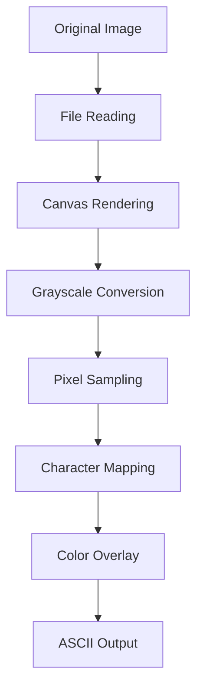

# ASCII GraphiConvert v1.0


A web application that converts images to colored ASCII art with real-time parameter adjustments and multiple export formats.

## ✨ Core Features

- **Real-time Image Conversion**
  Support for JPG/PNG/BMP/WEBP formats, maximum resolution 4000x4000
- **Smart Parameter Controls**
  - Output width adjustment (40-400 characters)
  - Contrast enhancement (50%-200%)
  - Sampling granularity control (1-10 levels)
  - Color intensity adjustment (0-100% transparency)
- **Multiple Export Options**
  - 📋 One-click copy to clipboard
  - 📄 Export as TXT text file
  - 🖼️ Export as PNG image
- **Modern UI Design**
  - Dark theme UI with drag-and-drop upload support
  - Responsive layout, perfectly optimized for mobile
  - Real-time preview with instant parameter effects

## 🚀 Quick Start

### Local Development
```bash
# Clone the project
git clone <repository-url>
cd asciiart/versions/V1_0

# Start local server with Python
python -m http.server 8000

# Or use Node.js
npx serve .

# Visit http://localhost:8000
```

### Online Experience
Simply open the `index.html` file in your browser to experience all features immediately.

## 📁 Project Structure

```
V1_0/
├── index.html          # Main entry page
├── image.html          # Image conversion page
├── README.md           # Project documentation
├── sitemap.xml         # Website sitemap
├── css/
│   └── common.css      # Unified styles
├── js/
│   ├── common.js       # Common utility modules
│   ├── image.js        # Core image processing logic
│   └── canvas.worker.js # Canvas worker thread
└── docm/
    ├── docm_zn.md      # Chinese development docs
    └── docm_en.md      # English development docs
```

## ⚙️ Technical Implementation

### Core Technology Stack
| Component | Implementation |
|-----------|----------------|
| Image Processing | Canvas API + Luminance Algorithm |
| Color Extraction | Dynamic RGBA Generation & Mapping |
| Frontend Framework | Vanilla JavaScript (ES6+) |
| Styling System | CSS Variables + Flexbox Layout |
| Export Functionality | html2canvas@1.4.1 |
| File Handling | FileReader API + Drag & Drop API |

### Image Processing Algorithm


#### Luminance Calculation Formula
```
Luminance = 0.299 × R + 0.587 × G + 0.114 × B
```

#### Character Mapping Table
Map luminance values to corresponding ASCII characters:
```javascript
const ASCII_CHARS = ' .:-=+*#%@';
// Gradient from dark to light characters
```

## 🎛️ Parameter Specifications

### Output Width (Width)
- **Range**: 40-400 characters
- **Purpose**: Controls overall width of ASCII art
- **Recommendation**: Portraits: 80-120, Landscapes: 150-200

### Contrast (Contrast)
- **Range**: 50%-200%
- **Purpose**: Enhance or reduce image contrast
- **Recommendation**: Dim images can be boosted to 120%-150%

### Sampling Granularity (Granularity)
- **Range**: 1-10 levels
- **Purpose**: Controls sampling density - higher values mean less detail
- **Recommendation**: Complex images: 3-5, Simple images: 8-10

### Color Intensity (Color Intensity)
- **Range**: 0-100%
- **Purpose**: Adjustes color saturation of ASCII characters
- **Recommendation**: Artistic effects: 60%-80%

## 🛠️ Development Guide

### Code Structure
```javascript
// Core class design
class ImageProcessor {
    constructor() {
        this.currentImage = null;
        this.params = {
            width: 100,
            contrast: 1.0,
            granularity: 4,
            colorIntensity: 0.7
        };
    }

    async loadAndProcess(file)     // Load and process image
    generate()                     // Generate ASCII art
    copyToClipboard()             // Copy functionality
    exportTXT()                   // Export text
    exportPNG()                   // Export image
}

class FileManager {
    static initDropZone()         // Initialize drag-drop zone
    // File handling related methods
}
```

### Extension Development
1. **Add New Character Sets**: Modify character mapping table in `js/image.js`
2. **Custom Themes**: Edit CSS variables in `css/common.css`
3. **New Export Formats**: Add export methods in `ImageProcessor` class

### Debugging Tips
```javascript
// Enable debug mode
const debugger = new Debugger();
debugger.logCanvas(canvas);  // View intermediate processing results
```

## 🌐 Deployment Solutions

### Vercel Deployment (Recommended)
1. Push code to GitHub repository
2. Import project in Vercel
3. Configure build settings: Static website hosting
4. Auto-deployment complete, get online access URL

### Manual Deployment
Can be deployed to any web server supporting static files:
- GitHub Pages
- Netlify
- Alibaba Cloud OSS
- Tencent Cloud COS

### Nginx Configuration Example
```nginx
server {
    listen 80;
    server_name your-domain.com;
    root /path/to/V1_0;
    index index.html;

    location / {
        try_files $uri $uri/ =404;
    }
}
```

## 📋 User Guide

### Basic Operation Flow
1. **Upload Image**: Click upload button or drag image to designated area
2. **Adjust Parameters**: Use sliders to adjust parameters in real-time
3. **Preview Effect**: View ASCII art effect in preview area below
4. **Export Result**: Choose appropriate export method to save your work

### Best Practice Recommendations
- **Image Selection**: Images with clear contrast and outlines work best
- **Parameter Combinations**: Recommended for portraits `Width:80 + Contrast:120% + Granularity:4`
- **File Size**: Recommend upload files under 5MB for optimal performance
- **Browser Compatibility**: Recommended to use modern browsers like Chrome, Firefox, Safari

## ❓ Frequently Asked Questions

**Q: What image formats are supported?**
A: Supports mainstream browser formats: JPG, PNG, BMP, WEBP, etc.

**Q: What to do if exported image is incomplete?**
A: Try reducing output width or increasing granularity value.

**Q: Can I use custom characters?**
A: Current version uses preset character sets. Custom characters will be supported in v2.0.

**Q: How to use on mobile?**
A: Fully supports mobile, can take photos or select from gallery.

## 🤝 Contributing Guide

We welcome all forms of contributions!

### How to Contribute
1. Fork this project
2. Create feature branch: `git checkout -b feature/new-feature`
3. Commit changes: `git commit -am 'Add new feature'`
4. Push branch: `git push origin feature/new-feature`
5. Create Pull Request

### Contribution Areas
- 🐛 Bug fixes
- ✨ New feature development
- 📝 Documentation improvements
- 🎨 UI/UX enhancements
- ⚡ Performance optimization

## 📄 License

This project is licensed under the MIT License - see the [LICENSE](LICENSE) file for details.

## 📞 Contact Us

- Project Homepage: [GitHub Repository]
- Issue Reporting: [GitHub Issues]
- Online Demo: [Demo Link]

---

**Version Info**: v1.0.0 | **Build Date**: 2025.03 | **Developers**: ASCII GraphiConvert Team

> Turn every image into a unique ASCII artwork! 🎨