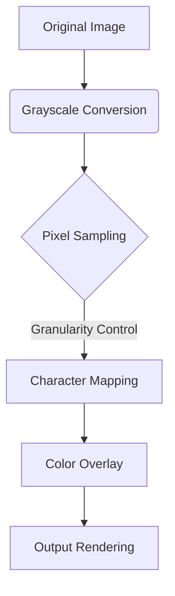

# ASCII Art Generator v1.0


A web application that converts images to colored ASCII art with real-time parameter adjustments and multiple export formats.

## ✨ Core Features

- **Real-time Conversion**  
  Supports JPG/PNG formats, up to 4000x4000 resolution
- **Smart Parameter Controls**
  - Granularity Adjustment (2-20 pixels)
  - Color Intensity (0-1 transparency)
  - Output Width (100-800 characters)
  - Contrast Enhancement (0.5-2.0x)
- **Export Options**
  - 📋 Copy to Clipboard
  - 📄 Export as TXT
  - 🖼️ Export as PNG
- **Responsive Design**
  Mobile-friendly with drag-and-drop support

## 🚀 Quick Deployment

### Vercel Deployment
[](https://vercel.com/new/clone?repository-url=YOUR_REPO_URL)

```bash
# Local Development
npm install -g vercel
vercel dev
```

### Manual Deployment
1. Create Vercel project
2. Upload following structure:
```
.
├── public/
│   ├── js/
│   │   ├── html2canvas.min.js
│   │   ├── common.js
│   │   └── image.js
│   └── css/
│       └── common.css
├── pages/
│   ├── index.html
│   └── image.html
└── vercel.json
```

3. Configure `vercel.json`:
```json
{
  "version": 2,
  "builds": [{ "src": "public/**", "use": "@vercel/static" }],
  "routes": [
    { "src": "/(.*)", "dest": "/public/$1" },
    { "src": "/image", "dest": "/public/pages/image.html" }
  ]
}
```

## ⚙️ Tech Stack

| Component | Description |
|-------|-------|
| Core Conversion | Canvas API + Luminance Algorithm |
| Color Processing | Dynamic RGBA Generation |
| Frontend Framework | Vanilla JavaScript |
| Styling Solution | CSS Variables + Flex Layout |
| Dependencies | html2canvas@1.4.1 |

## 🛠️ Development Guide

```bash
# Install Dependencies
curl -o public/js/html2canvas.min.js https://cdnjs.cloudflare.com/ajax/libs/html2canvas/1.4.1/html2canvas.min.js

# Local Testing
python3 -m http.server 8000
```

## 📜 Parameter Specifications

### Image Processing Flow


### Luminance Algorithm
\[
\text{Brightness} = 0.299R + 0.587G + 0.114B
\]

## 🤝 Contribution Guide

1. Fork the repository
2. Create feature branch (`git checkout -b feature/new-feature`)
3. Commit changes (`git commit -am 'Add new feature'`)
4. Push branch (`git push origin feature/new-feature`)
5. Create Pull Request

## 📄 License
MIT License | Copyright (c) 2023 [Your Name]