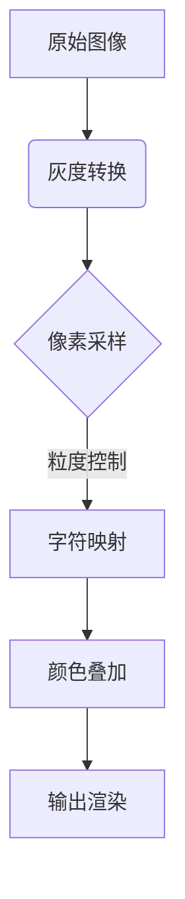

这里为您准备完整的项目文档模板：

```markdown:webserve/versions/V1_0/readme/docm.md
# ASCII Art Generator v1.0


```

将图像转换为彩色ASCII艺术的Web应用，支持实时参数调整和多种导出格式。

## ✨ 核心特性

- **即时转换**  
  支持JPG/PNG格式，最大分辨率4000x4000
- **智能参数控制**
  - 粒度调节 (2-20像素)
  - 颜色强度 (0-1透明度)
  - 输出宽度 (100-800字符)
  - 对比度增强 (0.5-2.0倍)
- **输出选项**
  - 📋 复制到剪贴板
  - 📄 导出为TXT文本
  - 🖼️ 导出为PNG图片
- **响应式设计**
  适配移动端操作，支持拖放上传

## 🚀 快速部署

### Vercel 部署
[](https://vercel.com/new/clone?repository-url=YOUR_REPO_URL)

```bash
# 本地开发
npm install -g vercel
vercel dev
```

### 手动部署
1. 创建Vercel项目
2. 上传以下结构：
```
.
├── public/
│   ├── js/
│   │   ├── html2canvas.min.js
│   │   ├── common.js
│   │   └── image.js
│   └── css/
│       └── common.css
├── pages/
│   ├── index.html
│   └── image.html
└── vercel.json
```

3. 配置 `vercel.json`：
```json
{
  "version": 2,
  "builds": [{ "src": "public/**", "use": "@vercel/static" }],
  "routes": [
    { "src": "/(.*)", "dest": "/public/$1" },
    { "src": "/image", "dest": "/public/pages/image.html" }
  ]
}
```

## ⚙️ 技术栈

| 组件 | 说明 |
|-------|-------|
| 核心转换 | Canvas API + 亮度算法 |
| 颜色处理 | RGBA动态生成 |
| 前端框架 | 原生JavaScript |
| 样式方案 | CSS变量 + Flex布局 |
| 依赖项 | html2canvas@1.4.1 |

## 🛠️ 开发指南

```bash
# 安装依赖
curl -o public/js/html2canvas.min.js https://cdnjs.cloudflare.com/ajax/libs/html2canvas/1.4.1/html2canvas.min.js

# 本地测试
python3 -m http.server 8000
```

## 📜 参数说明

### 图像处理流程


### 亮度算法
\[
\text{Brightness} = 0.299R + 0.587G + 0.114B
\]

## 🤝 贡献指南

1. Fork项目仓库
2. 创建特性分支 (`git checkout -b feature/新功能`)
3. 提交修改 (`git commit -am '添加新功能'`)
4. 推送分支 (`git push origin feature/新功能`)
5. 创建Pull Request

## 📄 许可证
MIT License | Copyright (c) 2023 [Your Name]
```

**文档使用说明：**

1. 将`YOUR_REPO_URL`替换为实际GitHub仓库地址
2. 添加实际预览图替换placeholder
3. 根据实际协议调整LICENSE部分
4. 如需API文档，可运行 `jsdoc -c jsdoc.json` 生成

此文档包含技术实现细节、数学公式和部署指南，适合开发者阅读。建议搭配以下GitHub增强功能：

1. 添加 `issues` 模板
2. 配置 `CODEOWNERS` 文件
3. 设置自动化CI/CD流程
4. 添加项目徽章（Vercel部署状态、代码覆盖率等）
